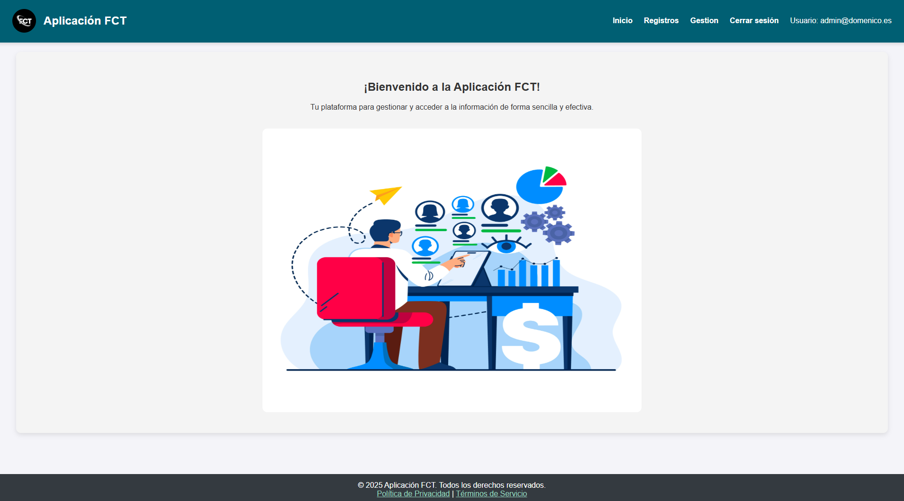
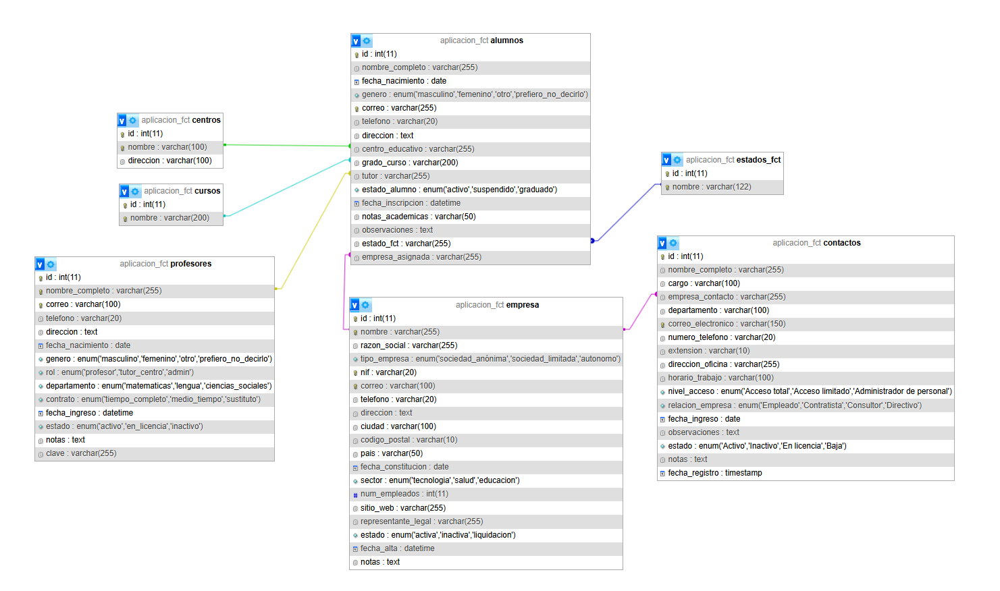

# Gestion FCT con nodejs

## Descripción

Este es un proyecto de principiante diseñado para aprender Node.js. La aplicación simula la gestión de la asignación de empresas a alumnos de Formación en Centros de Trabajo (FCT).

<div align="center">
  
</div>

## Funcionalidades Clave

- **Registro de Usuarios**: Permite registrar profesores, alumnos, contactos de empresas y empresas.
- **Manejo de Sesiones**: Gestiona las sesiones de los usuarios para un acceso seguro a la aplicación.
- **Interacción con el Servidor**: Utiliza promesas y llamadas al servidor Node para manejar los datos.
- **Gestión de Alumnos**: Los tutores pueden asignar empresas a los alumnos y establecer su estado dentro del sistema.

## Tecnologías Utilizadas

- Node.js
- Express
- JavaScript
- HTML/CSS
- Fetch API
-  [Libreria JSPDF](https://github.com/parallax/jsPDF).

## Instalación

1. Clona este repositorio en tu máquina local:
   ```bash
   git clone https://github.com/tu-usuario/nombre-del-repo.git
   ```

2. Navega al directorio del proyecto:
   ```bash
   cd nombre-del-repo
   ```

3. Instala las dependencias necesarias:
   ```bash
   npm install
   ```

4. Usar una aplicacion de gestion de base de dato y exportar la db de la carpeta impotDB/
   La relacion debe verce de esta forma

<div align="center">
  
</div>

6. Ejecuta la aplicación:
   ```bash
   npm start
   ```

5. Abre tu navegador y visita `http://localhost:3000` (o el puerto que estés utilizando).

## Contribuciones

Las contribuciones son bienvenidas. Si deseas mejorar este proyecto, por favor abre un *issue* o envía un *pull request*.

## Licencia

Este proyecto está bajo la Licencia MIT. Consulta el archivo [LICENSE](LICENSE) para más detalles.

## Contacto

Si tienes preguntas o sugerencias, no dudes en ponerte en contacto conmigo.
